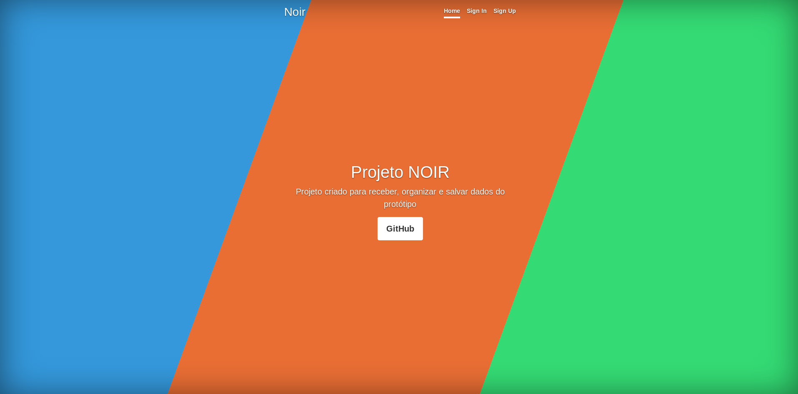
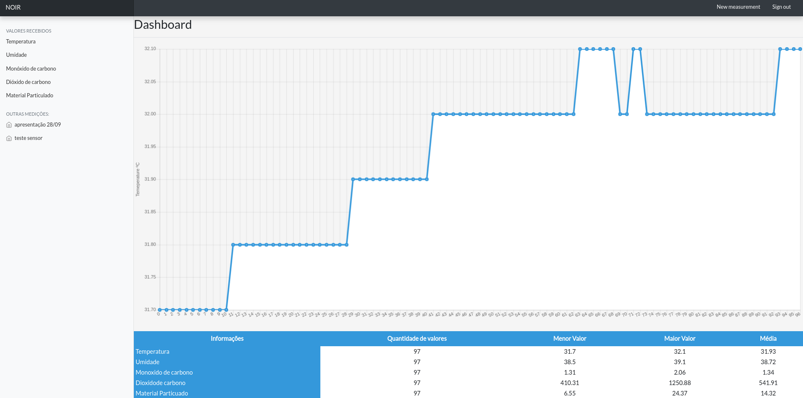

# NOIR - DJANGO

- Instalar Dependências
- Definir variável de ambiente:

ex:
- SECRET_KEY="secret_key"
- DEBUG="true"
- export DATABASE_URL='sqlite:///sqlite.db'

## API

```
/api/gases/    - medições recebidas
/api/sensors/  - grupo de medições do sensor
```
## Imagens




